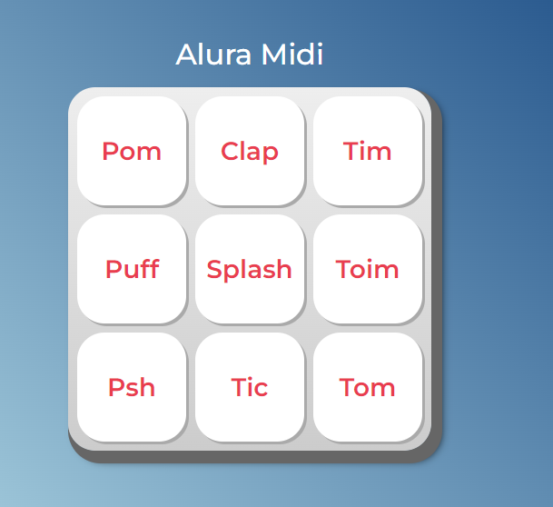

# Página Dinâmica com JavaScript

## Projeto desenvolvido durante o curso da Alura onde criamos uma página diâmica que toca som de alguns instrumentos musicais. 👩🏽‍💻

### [Clique Aqui para Acessar a página](https://letsle.github.io/JavaScript-para-Web/)

